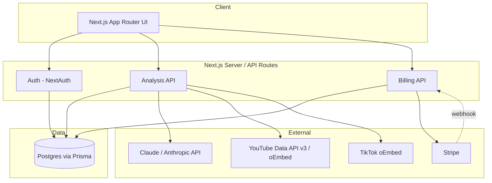
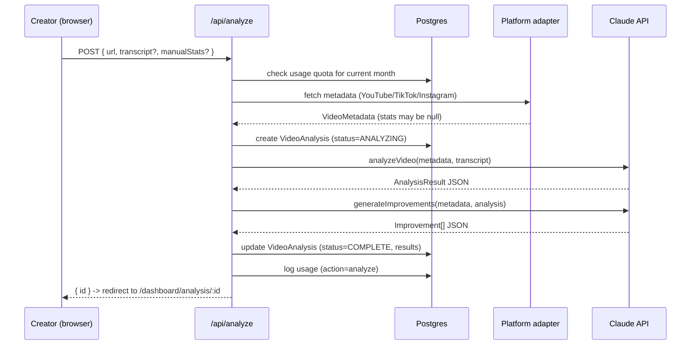

# Hookcast — Architecture

## 1. System overview



A single Next.js app serves both the UI and the API (App Router route handlers under `app/api/`). There is no separate backend service — Prisma talks to Postgres directly from route handlers, and the Anthropic and Stripe SDKs are called server-side only (API keys never reach the client).

## 2. Why this stack

- **Next.js App Router** gives server components (so dashboard pages can query Prisma directly without a client-side fetch waterfall) alongside API routes for the parts that genuinely need a request/response contract (form submissions, webhooks).
- **Prisma + Postgres** for a typed schema with real relations (a video analysis has many redesign versions and many similar-video results) and straightforward migrations.
- **NextAuth** for session handling with minimal custom auth code; Credentials provider covers email/password out of the box, Google is a few lines to enable.
- **Stripe** for subscription billing — Checkout for the initial purchase, Billing Portal for self-service plan/payment-method changes, and a webhook to keep `Subscription.status`/`plan` in sync with what Stripe actually charged.
- **Claude (Anthropic API)** is the analysis engine itself, not a bolt-on feature — see §4.

## 3. Data model

Defined in `prisma/schema.prisma`. The core entities:

- **User / Account / Session / VerificationToken** — standard NextAuth Prisma-adapter shape.
- **Subscription** — one per user, tracks plan (`FREE`/`PRO`/`AGENCY`), Stripe IDs, and period end. Created with `plan: FREE` at signup so quota checks always have a row to read.
- **UsageLog** — one row per billable action (`analyze`/`regenerate`/`similar`), timestamped. Monthly quota is computed by counting rows since the start of the current calendar month rather than maintaining a separate counter — simpler to reason about and trivially auditable.
- **VideoAnalysis** — the core record: source URL, platform, fetched metadata, optional user-pasted transcript, and the two Claude JSON payloads (`analysisJson` matching `AnalysisResult` in `types/index.ts`, and `improvements` matching `Improvement[]`).
- **RedesignVersion** — one-to-many off `VideoAnalysis`; every "Regenerate" click adds a new row rather than overwriting, so creators can compare iterations.
- **SimilarVideo** — one-to-many off `VideoAnalysis`; replaced (not appended) on each "Find similar videos" click, since stale similar-video links degrade in value quickly as the search re-runs.

`viewCount`/`likeCount`/`commentCount`/`shareCount` are `BigInt` in Postgres (some platforms' counts can exceed JS's safe integer range at extreme scale) — see `lib/serialize.ts` for why API responses convert these to plain `number` before `JSON.stringify` (which throws on raw `BigInt`).

## 4. The Claude analysis engine (`lib/claude.ts`)

Four Claude calls, each with a narrow system prompt and a strict "respond with ONLY JSON matching this shape" instruction, parsed defensively (`extractJson` tolerates stray prose or ```json fences rather than hard-failing):

1. **`analyzeVideo`** — the core diagnosis (score, verdict, hook/script/editing breakdown, ranked factors). Explicitly instructed not to invent transcript content it wasn't given, and to fall back to structural/title-based reasoning with that limitation stated in `benchmarkNote` rather than fabricating numbers.
2. **`generateImprovements`** — takes the analysis JSON and produces a short, impact-ranked action list. Separated from step 1 so the two can be cached/regenerated independently if the product later wants to let users re-roll just the suggestions.
3. **`generateRedesign`** — produces a literal rewritten hook + script (not advice about a hook), optionally steered by free-text focus notes from the creator. Higher temperature (0.7) than the analysis call (0.3) since this is a creative-generation task, not a judgment task.
4. **`findSimilarVideos`** — the only call that uses the Anthropic API's server-side `web_search_20250305` tool, so Claude can find and cite *real* URLs instead of hallucinating plausible-looking ones. The prompt explicitly instructs Claude to omit any match it can't back with a verifiable URL. This is also the most failure-prone call (search-grounded generation is less deterministic about output format), so it fails soft to an empty array rather than breaking the rest of the analysis page.

All four share `MODEL = process.env.ANTHROPIC_MODEL || 'claude-sonnet-4-6'` so the model is swappable per-deployment without code changes.

## 5. Platform metadata: what's real, what's a deliberate stub

This is the part most likely to surprise someone extending the app, so it's documented explicitly rather than left to be discovered in code:

- **YouTube** (`lib/platforms/youtube.ts`): with `YOUTUBE_API_KEY` set, this is a real, fully-functional integration against the Data API v3 `videos.list` endpoint — real view/like/comment counts, duration, publish date. Without a key, it falls back to YouTube's public oEmbed endpoint (no auth required), which only returns title/author/thumbnail. The metadata object's `needsManualStats` flag tells the UI to prompt for counts in that case.
- **TikTok** (`lib/platforms/tiktok.ts`): TikTok has no public, key-based API for arbitrary video stats. Its oEmbed endpoint (no auth) is real and used for title/author/thumbnail, but counts always come from the manual-stats fallback in `AnalyzeForm`.
- **Instagram** (`lib/platforms/instagram.ts`): Instagram retired unauthenticated oEmbed access. Reading an arbitrary public Reel's metadata now requires the Instagram Graph API with an app review and — critically — the *Reel owner's* access token; there is no way to fetch a stranger's Reel by URL with a simple API key. Rather than scraping (fragile, against platform ToS, and breaks without warning), this adapter is an intentional no-op that returns an empty shell, and the product asks the user to paste the title/caption/stats instead. **If you need real Instagram metadata**, the realistic paths are: (a) a licensed third-party social data provider (e.g., a paid scraping/API aggregator), or (b) Instagram Graph API access scoped to your own connected business accounts only. Both are deliberately left as a follow-up integration rather than baked in, since they involve real commercial/legal tradeoffs the product owner needs to choose.

This asymmetry (YouTube/TikTok mostly automatic, Instagram mostly manual) is a real constraint of these platforms in 2025–2026, not a shortcut taken in this scaffold.

## 6. Request flow: submitting an analysis



Redesign and similar-video search follow the same shape as separate, on-demand calls (`/api/regenerate`, `/api/similar`) so a creator isn't forced to pay the latency/cost of every feature on every analysis.

## 7. Known scaling limit (read before high traffic)

`/api/analyze` currently runs the metadata fetch and two Claude calls **synchronously inside a single request**. For an MVP this is the simplest correct thing to do and keeps the codebase easy to reason about. It has a real ceiling, though: most serverless hosts cap request duration (commonly 10–60s on default tiers), and a slow Claude response or a large transcript can approach that. Before scaling past light traffic, move `/api/analyze` to: enqueue a job (e.g., a simple Postgres-backed queue table, or a managed queue), return immediately with `status: PENDING`, process the job in a background worker/cron, and have the client poll `/api/analyses/:id` (already built) until `status` flips to `COMPLETE`. The data model already supports this (`AnalysisStatus` enum has `PENDING`/`FETCHING_METADATA`/`ANALYZING` precisely for this reason) — only the API route's control flow needs to change.

## 8. Security notes

- All API routes that touch user data check `getServerSession` and scope every Prisma query with `userId` — there is no endpoint that trusts a client-supplied user ID.
- `middleware.ts` additionally blocks unauthenticated access to `/dashboard/*` at the edge, before any page code runs.
- Stripe webhook signature verification (`stripe.webhooks.constructEvent`) is required — the route 400s if the secret isn't configured rather than silently accepting unsigned events.
- Passwords are hashed with bcrypt (cost factor 10); plaintext is never stored or logged.
- Claude API keys, Stripe secret keys, and the database URL are server-only env vars (no `NEXT_PUBLIC_` prefix) and are never sent to the client.

## 9. Deployment

Any Node.js host that supports Next.js works (Vercel is the path of least resistance for this stack specifically). Steps:

1. Provision Postgres (Vercel Postgres, Supabase, RDS, etc.) and set `DATABASE_URL`.
2. Set all required env vars from `.env.example` in the hosting platform's dashboard.
3. Run `npx prisma migrate deploy` (after switching from `db push` to versioned migrations — generate the first migration locally with `npx prisma migrate dev --name init` before deploying).
4. Point the Stripe webhook at `https://yourdomain.com/api/stripe/webhook` and copy the signing secret into `STRIPE_WEBHOOK_SECRET`.
5. Deploy. Confirm `NEXTAUTH_URL` matches the production domain exactly (NextAuth uses it for callback URLs and cookie scoping).

## 10. Testing strategy (recommended, not included)

Not built into this scaffold, but the natural seams to test first: `lib/utils.ts` (`detectPlatform`, `formatCount` — pure functions, easy unit tests), `lib/claude.ts`'s `extractJson` (feed it malformed/fenced output and assert it still parses), and an integration test against `/api/analyze` with the Anthropic client mocked (so tests don't burn real API credits or depend on network access).
